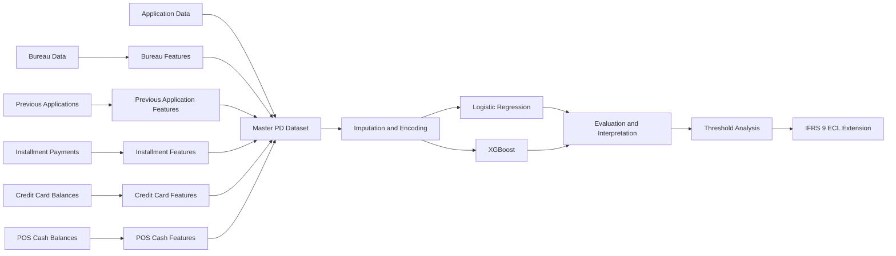
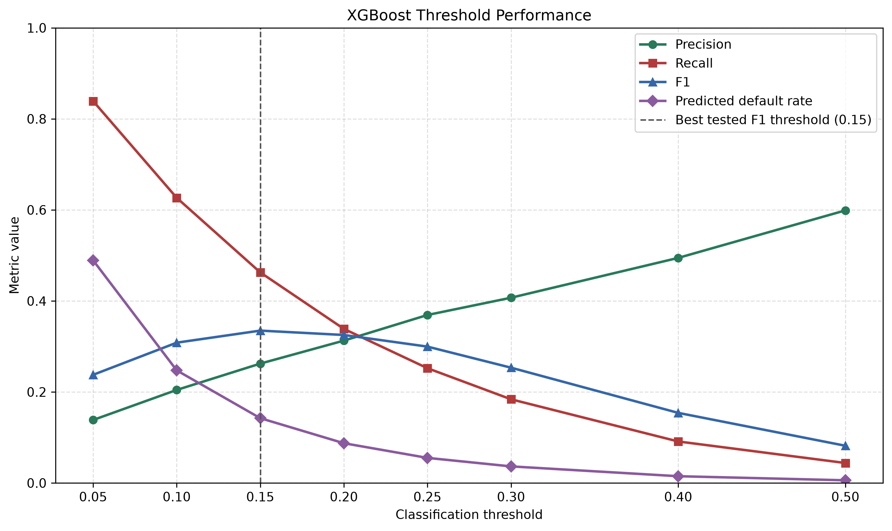

# IFRS9 Home Credit PD Model

An end-to-end credit risk analytics project for estimating borrower Probability
of Default (PD) using application data and historical credit behavior.

## 1. Project Overview

This project builds a borrower-level PD modeling workflow using the Home Credit
Default Risk dataset. It covers:

- Chunk-based processing of large transactional datasets
- Borrower-level feature engineering
- Automated construction of a master modeling dataset
- Logistic Regression and XGBoost classification
- Model evaluation and threshold analysis
- Logistic coefficient interpretation
- A simplified IFRS 9 Expected Credit Loss extension

### Project Metrics

| Metric | Value |
| --- | ---: |
| Borrowers | **307,511** |
| Features | **175** |
| Observed default rate | **8.07%** |
| Logistic Regression ROC-AUC | **0.770** |
| XGBoost ROC-AUC | **0.781** |
| Best tested XGBoost threshold | **0.15** |

The project is designed as a professional credit risk portfolio case study. It
demonstrates modeling concepts relevant to credit risk analytics and IFRS 9,
but it is not an accounting-compliant production model.

## 2. Business Problem

Lenders must identify applicants with elevated credit risk while balancing two
competing costs:

- Approving borrowers who subsequently default
- Rejecting creditworthy borrowers and losing profitable business

The target variable is `TARGET`:

- `TARGET = 0`: no observed payment difficulty
- `TARGET = 1`: observed payment difficulty

The modeling workflow addresses three practical questions:

1. How accurately can historical borrower information rank default risk?
2. Which application and behavioral characteristics are associated with risk?
3. Which classification threshold provides an appropriate balance between
   precision and recall?

## 3. Dataset

The project uses the
[Home Credit Default Risk](https://www.kaggle.com/competitions/home-credit-default-risk)
dataset.

| Source | Description |
| --- | --- |
| `application_train.csv` | Current applications, borrower profiles, loan terms, external scores, and target |
| `bureau.csv` | Loans reported by external credit bureaus |
| `previous_application.csv` | Historical Home Credit applications |
| `installments_payments.csv` | Scheduled and actual installment payments |
| `credit_card_balance.csv` | Credit card balances, utilization, payments, and delinquency |
| `POS_CASH_balance.csv` | Monthly POS and cash loan status |

The final master dataset contains **307,511 borrowers** and **175 features**,
with one row per `SK_ID_CURR`.

Raw and processed data are excluded from Git because of their size and must be
generated locally.

## 4. Data Architecture

Each historical table is aggregated to borrower level before being left-joined
to the application population. This prevents one-to-many duplication and
preserves all training applications.



The master dataset is saved to:

```text
data/processed/master_pd_dataset.parquet
```

Pipeline controls include:

- Unique borrower-key validation
- One-to-one merge validation
- Row-count reconciliation
- Missing-value reporting
- Target distribution checks
- Feature-name collision checks

## 5. Feature Engineering

Large transactional files are read in chunks and converted into borrower-level
behavioral features.

| Feature Group | Examples |
| --- | --- |
| Bureau | Active and closed loans, credit exposure, annuity, credit-history age |
| Previous applications | Application counts, approval rate, refusal count, credit amount, recency |
| Installments | Payment ratio, underpayment, late payment rate, days past due |
| Credit cards | Balance, credit limit, utilization, drawings, payments, delinquency |
| POS cash | Contract count, installment terms, remaining installments, late payment rate |
| Application | Demographics, income, employment, loan terms, housing, external scores |

`SK_ID_CURR` is retained for lineage and validation but excluded from model
training.

## 6. Modeling Approach

The data is divided into an **80% training set** and a **20% test set** using a
stratified split with `random_state=42`.

### Logistic Regression

The baseline model uses:

- Median imputation for numeric variables
- Most-frequent imputation for categorical variables
- Numeric standardization
- One-hot encoding
- Balanced class weights

Logistic Regression provides an interpretable benchmark and supports
coefficient-based analysis of risk drivers.

### XGBoost

The challenger model uses:

- Median and most-frequent imputation
- Sparse one-hot encoding
- Histogram-based gradient boosting
- Row and feature subsampling
- Regularized tree parameters

Both preprocessing and estimation steps are saved as complete Scikit-learn
pipelines with Joblib.

## 7. Results

### Model Performance

| Model | ROC-AUC | Precision | Recall | F1 |
| --- | ---: | ---: | ---: | ---: |
| Logistic Regression | **0.770** | 0.173 | 0.699 | 0.277 |
| XGBoost at threshold 0.50 | **0.781** | 0.599 | 0.044 | 0.082 |

XGBoost improves ROC-AUC from **0.770 to 0.781**, indicating stronger overall
risk ranking. However, the default threshold of `0.50` produces low recall,
demonstrating why threshold selection must be treated separately from model
discrimination.

### Threshold Analysis

| Threshold | Precision | Recall | F1 | Predicted Default Rate |
| ---: | ---: | ---: | ---: | ---: |
| 0.05 | 0.138 | 0.839 | 0.238 | 48.92% |
| 0.10 | 0.204 | 0.627 | 0.308 | 24.74% |
| **0.15** | **0.262** | **0.463** | **0.335** | **14.24%** |
| 0.20 | 0.313 | 0.339 | 0.325 | 8.74% |
| 0.25 | 0.369 | 0.252 | 0.300 | 5.52% |
| 0.30 | 0.407 | 0.184 | 0.253 | 3.65% |
| 0.40 | 0.495 | 0.091 | 0.154 | 1.49% |
| 0.50 | 0.599 | 0.044 | 0.082 | 0.59% |

The **best tested threshold is 0.15**, with an F1 score of `0.335`. A production
threshold should ultimately reflect expected loss, approval economics,
collections capacity, and risk appetite rather than F1 alone.



## 8. Repository Structure

```text
ifrs9-home-credit-pd-model/
|-- data/
|   |-- raw/
|   `-- processed/
|-- models/
|-- notebooks/
|   |-- 01_download_data.ipynb
|   |-- 02_data_overview.ipynb
|   |-- 03_target_eda.ipynb
|   `-- 04_model_interpretation.ipynb
|-- outputs/
|   |-- figures/
|   `-- reports/
|-- src/
|   |-- features/
|   |   |-- compute_bureau_features.py
|   |   |-- compute_previous_application_features.py
|   |   |-- compute_installments_features.py
|   |   |-- compute_credit_card_features.py
|   |   |-- compute_pos_cash_features.py
|   |   `-- build_master_dataset.py
|   `-- models/
|       |-- train_baseline_logistic.py
|       |-- train_xgboost.py
|       |-- threshold_analysis.py
|       `-- ifrs9_ecl_framework.py
|-- README.md
`-- requirements.txt
```

### Reproducing the Workflow

```bash
python -m pip install -r requirements.txt
python src/features/compute_bureau_features.py
python src/features/compute_previous_application_features.py
python src/features/compute_installments_features.py
python src/features/compute_credit_card_features.py
python src/features/compute_pos_cash_features.py
python src/features/build_master_dataset.py
python src/models/train_baseline_logistic.py
python src/models/train_xgboost.py
python src/models/threshold_analysis.py
python src/models/ifrs9_ecl_framework.py
```

## 9. Future IFRS 9 Extension

The current model provides a statistical PD proxy. A production-oriented IFRS
9 framework would require:

- Formal default definitions and observation/performance windows
- Calibrated 12-month and lifetime PD term structures
- Significant Increase in Credit Risk methodology
- Stage 1, Stage 2, and Stage 3 allocation
- Point-in-time and through-the-cycle calibration
- Forward-looking macroeconomic scenarios and probability weights
- Product-specific LGD models using recoveries and collateral
- EAD and credit conversion factor models
- Effective-interest-rate discounting
- Scenario-weighted Expected Credit Loss
- Out-of-time validation, monitoring, and model governance

The repository includes a simplified analytical implementation of:

```text
ECL = PD x LGD x EAD
```

It produces borrower-level PD and ECL estimates using transparent Stage 1,
Stage 2, LGD, and EAD assumptions. These outputs are illustrative and should
not be interpreted as accounting-compliant IFRS 9 estimates.
